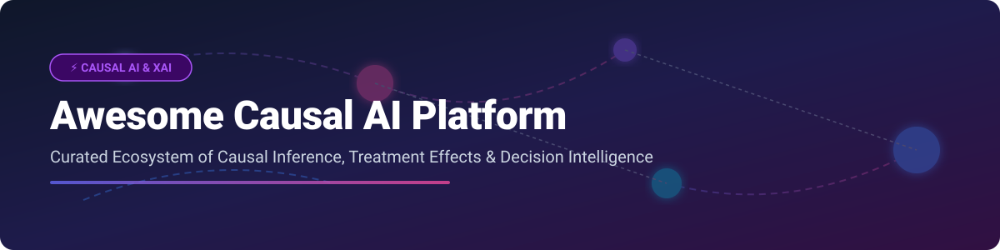
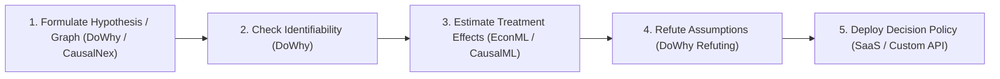

# 🎯 Awesome Causal AI Platform

    

## 🚀 Top Causal AI Platforms & Decision Intelligence Ecosystem

> **Curated List of SaaS Products & Open-Source GitHub Projects**  
> *Focused on Causal Inference, Treatment Effect Estimation, Root-Cause Analysis, Counterfactual Reasoning, Decision Intelligence & Explainable Causal Models (XAI).*

📅 **Last updated: September 2026**

---

## 🔍 Overview & SEO Highlights

Welcome to the ultimate resource directory for **Causal AI Platforms**, **Causal Machine Learning Libraries**, and **Decision Intelligence Systems**. Unlike traditional predictive machine learning that relies solely on correlation, **Causal AI** enables organizations and data scientists to understand cause-and-effect relationships, calculate heterogeneous treatment effects (HTE), simulate counterfactual scenarios, and automate root-cause discovery.

Key capabilities tracked in this ecosystem include:
- **Treatment Effect Estimation & Uplift Modeling** (Double ML, Meta-Learners, Propensity Scores)
- **Causal Discovery & Structure Learning** (DAG estimation from observational data)
- **Root-Cause Analysis (RCA)** & Automated Diagnostics in Observability
- **Counterfactual Reasoning & What-If Simulations** for Business Decision Intelligence

---

## 📋 Table of Contents

- [🏢 SaaS/Hosted Platforms](#-saashosted-platforms)
- [⚡ Open-Source GitHub Projects](#-open-source-github-projects)
- [💡 Guidelines & Architecture](#-guidelines--architecture)
- [🤝 How to Contribute](#-how-to-contribute)
- [💖 Support & Sponsorship](#-support--sponsorship)
- [📈 Star History](#-star-history)
- [⚠️ Disclaimer](#%EF%B8%8F-disclaimer)

---

## 🏢 SaaS/Hosted Platforms

### 📊 Market Size & Industry Concentration
> 💡 **Market Insights**: The global Causal AI & Decision Intelligence market is estimated at **~$300M - $500M (2026)** and is projected to expand at a CAGR of **>35%** toward **$2.5B+ by 2030**. The market is currently **moderately fragmented**: early enterprise category leaders (e.g. Dynatrace, C3 AI, DataRobot) are embedding causal capabilities alongside specialized vertical category leaders (e.g. CausaLens DecisionOS).

| Product & Description | Market Footprint / Company Size (Revenue / Valuation) | Pricing | Free Tier Limits |
| :--- | :--- | :--- | :--- |
| **[Dynatrace Davis AI](https://www.dynatrace.com/)** Causal AI-powered observability and automated root-cause analysis within the Dynatrace platform. | **~$1.4B Annual Revenue** ($14B+ Market Cap) | Enterprise pay-as-you-go / DDU consumption pricing | 15-day free trial with 200,000 Davis Data Units (DDUs) included |
| **[C3 AI](https://c3.ai/)** Enterprise AI platform with causal and decision-intelligence capabilities applied across industrial and business use cases. | **~$310M Annual Revenue** ($3B+ Market Cap) | Standard pilot starts at $250,000 upfront; ongoing consumption at $0.55/vCPU-hour | 14-day free trial on Google Cloud Marketplace / 30-day free trial for Agentic AI |
| **[DataRobot Causal AI](https://www.datarobot.com/)** Causal and decision-intelligence features within DataRobot’s enterprise AI platform. | **~$250M ARR** ($3B+ Peak Valuation) | Enterprise annual subscription with custom quote | 30-day free trial with full GenAI and agentic feature access |
| **[CausaLens / causalens DecisionOS](https://causalens.com/)** Causal AI and decision intelligence platform combining causal reasoning with multi-agent systems, digital workers, and enterprise workflow automation. | **~$85M Valuation** ($50M+ Total Funding) | Custom quote via enterprise demo | Free trial available upon request via Demo Hub |
| **[WhyLabs Causal](https://whylabs.ai/)** Observability and causal capabilities within the WhyLabs AI Control and monitoring ecosystem. | **~$40M Valuation** ($14M+ Funding) | Starter edition free; Enterprise platform requires commercial quote | Free Starter plan includes monitoring for 1 model/dataset profile at no cost |
| **[Graphext](https://www.graphext.com/)** Data exploration and causal analysis platform focused on understanding drivers and relationships in business data. | **~$5M - $10M Valuation** ($5M+ Funding) | Pro plan starts at $150/month (billed annually) | Free plan includes 4,000 rows limit, 4 projects, and 1 editor seat |
| **[Abzu AI](https://www.abzu.ai/)** Explainable and causal-oriented AI platform (QLattice / Feyn) focused on transparent models and scientific insight. | **~$5M - $10M Valuation** (Seed / Series A) | B2B enterprise custom quote; academic research engagements | Free open-source Python library (`feyn`) and community QLattice research access |
| **[PyWhy Enterprise / commercial extensions](https://www.pywhy.org/)** Enterprise offerings and support around the open PyWhy causal machine learning ecosystem. | **Open Source Ecosystem** (Backed by PyWhy Foundation/Microsoft/Amazon) | Community open-source model; infrastructure costs apply on cloud integrations | 100% free open-source ecosystem (MIT / Apache 2.0 licenses) |
| **[DoWhy Cloud / managed causal services](https://www.pywhy.org/)** Hosted or managed offerings built on or complementary to the open DoWhy causal inference library. | **Community Managed / Cloud Ecosystem** | Enterprise cloud compute integration costs (varies by Cloud Marketplace) | Community self-hosted edition is free under MIT license |

---

## ⚡ Open-Source GitHub Projects

Below is the curated list of top open-source Python and R repositories for causal inference, discovery, uplift modeling, and counterfactual analysis, sorted by GitHub popularity:

| Repository & Description | GitHub_Stars & Popularity | License |
| :--- | :--- | :--- |
| **[DoWhy](https://github.com/py-why/dowhy)** Leading open-source Python library for end-to-end causal inference—model, identify, estimate, refute—unifying causal graphs and potential outcomes. |  | MIT (PyWhy) |
| **[CausalImpact](https://github.com/google/CausalImpact)** Google's open-source package for Bayesian structural time-series analysis of causal intervention effects. |  | Apache-2.0 |
| **[EconML](https://github.com/py-why/EconML)** Open-source library from Microsoft Research / PyWhy for estimating heterogeneous treatment effects using modern ML (double ML, meta-learners, causal forests). |  | BSD-3-Clause |
| **[CausalML](https://github.com/uber/causalml)** Open-source Python package from Uber focused on uplift modeling and causal inference for marketing, campaign, and product optimization. |  | Apache-2.0 |
| **[CausalNex](https://github.com/quantumblacklabs/causalnex)** Open-source library by QuantumBlack/McKinsey for causal reasoning using Bayesian networks—structure learning and expert-informed causal graphs. |  | Apache-2.0 |
| **[causal-learn](https://github.com/py-why/causal-learn)** Python translation and expansion of Tetrad for causal discovery algorithms (PC, FCI, FGES, ANM, LiNGAM). |  | MIT |
| **[YLearn](https://github.com/DataCanvas/YLearn)** End-to-end causal learning Python package supporting causal discovery, representation, estimation, and policy evaluation. |  | Apache-2.0 |
| **[Tigramite](https://github.com/jakobrunge/tigramite)** Open-source Python toolkit for causal discovery and time-series causal inference (PCMCI algorithm). |  | GPL-3.0 |
| **[Tetrad / py-tetrad](https://github.com/cmu-phil/tetrad)** Carnegie Mellon University's mature suite for constraint- and score-based causal discovery and structural equation modeling. |  | GPL-2.0 |
| **[gcm (DoWhy Graph Causal Models)](https://github.com/py-why/dowhy)** Sub-module of DoWhy for modeling complex causal graphs, performing causal attribution, and root-cause analysis. |  | MIT |

---

## 💡 Guidelines & Architecture

### 🛠️ Building Custom Open-Source Causal Pipelines
- **Identification & Refutation**: Use **DoWhy** to encode domain knowledge as a Directed Acyclic Graph (DAG), verify identifiability, and validate refutations (placebo treatments, random common cause).
- **Heterogeneous Effects & Uplift**: Use **EconML** for Double Machine Learning (DML) or **CausalML** for uplift trees in marketing/experimentation.
- **Causal Discovery**: Apply **causal-learn** or **Tigramite** when the DAG is unknown and needs to be learned from observational data.

---

## 🤝 How to Contribute

Contributions are always welcome! 

1. Fork the repository.
2. Add your SaaS product or Open-Source project to `README.md` following the table format.
3. Submit a Pull Request with a brief explanation of the tool's causal capabilities.

---

## 💖 Support & Sponsorship

If you find this repository helpful for your research, enterprise decision engineering, or data science workflows, please consider supporting the project:

- 🌟 **Star the repository** to help others discover it!
- 🔀 **Fork it** to add your own collection or contribute back.
- 📢 **Share** with your colleagues and data science network.
- ☕ **Buy me a coffee**: Sponsor this work directly via the [GitHub Sponsor Dashboard](https://github.com/sponsors/ishandutta2007).

---

## 📈 Star History

---

## ⚠️ Disclaimer

- This is a **community-curated** list for informational and educational purposes only.
- Causal inference relies on strong domain assumptions (e.g. unconfoundedness, positivity) that must be validated by domain experts. Incorrect application of causal tools can lead to flawed decision-making.

---

  <b>Made with ❤️ for Data Scientists, Decision Engineers, and Causal AI Researchers.</b>

